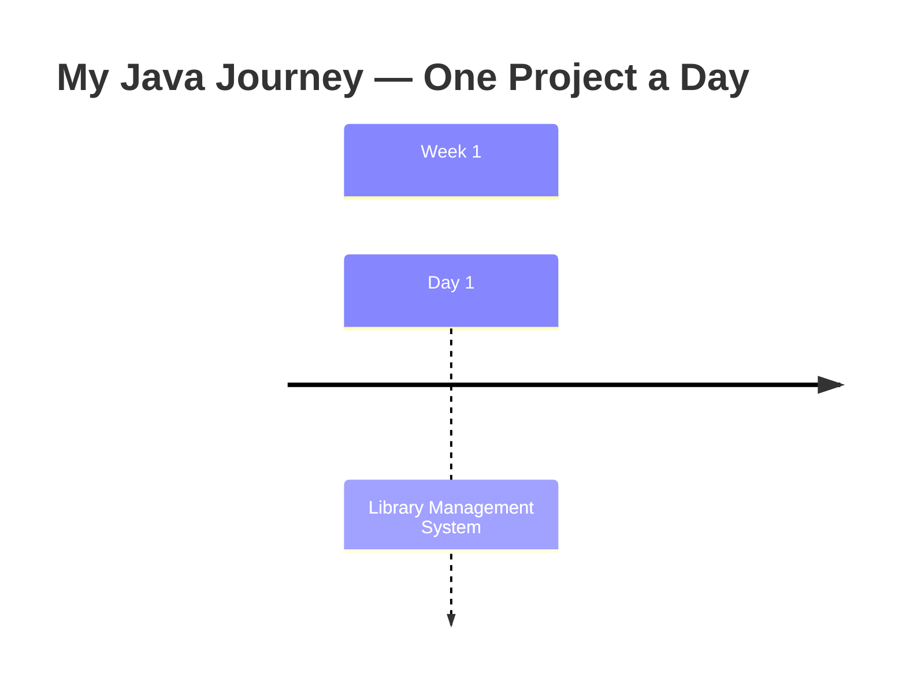

# ☕ Daily Projects — One Java Project a Day


> **Learning by building, not by watching.**

Hi! I'm an **MSc student at UCL**, and this repository is my public commitment to a simple rule: **build one project every single day.**

Like many self-taught and university-taught developers, I found myself stuck in *tutorial hell* — endlessly watching videos and following along, without ever truly owning what I learned. This repo is my way out of that loop, and my way of fighting **imposter syndrome** with the only cure that actually works: **proof of work**.

Some of these projects may look small or even silly. That's intentional. Each one exists to expose and fix a specific gap in my understanding of Java — collections, OOP design, exception handling, I/O, generics, streams — one gap at a time. What matters isn't the size of the project; it's that **I wrote it myself, understood it, and shipped it that day.**

## 🎯 The Roadmap

This journey has a clear destination. Mastering the fundamentals here is **step one** of a longer path:

```
Java Fundamentals  ──►  Spring Boot  ──►  React  ──►  Docker
     (you are here)        (backend)      (frontend)   (deployment)
```

By the end, the goal is to be able to design, build, and deploy full-stack applications end to end — and to have the daily receipts in this repo to prove how I got there.

## 📁 Repository Structure

Projects are organised by week and day:

```
Week 1/
└── Day 1/
    └── Library Management System/
        ├── Book.java
        ├── Library.java
        └── Member.java
Week 2/
└── ...
```

## 🗓️ Project Timeline

This timeline is **generated automatically** by a GitHub Action every time a new project is pushed. (It can also be refreshed manually — see below.)

<!-- TIMELINE:START -->

**1 project completed so far** &nbsp;|&nbsp; one per day 🔥



| # | Week | Day | Project | Completed |
|---|------|-----|---------|-----------|
| 1 | Week 1 | Day 1 | [Library Management System](Week%201/Day%201/Library%20Management%20System) | 18 Jul 2026 |

<!-- TIMELINE:END -->

### Updating the timeline manually

```bash
python3 scripts/update_timeline.py
```

The script scans every `Week */Day */Project` folder, pulls each project's first-commit date from git history, and rewrites the timeline + table above. The GitHub Action in `.github/workflows/update-timeline.yml` runs the same script on every push, so normally you never need to touch it.

## 🧭 Why This Matters (to me, and maybe to you)

- **Consistency beats intensity.** One honest project a day compounds faster than a weekend binge of tutorials.
- **Small projects are diagnostic tools.** Every project here started with a question: *"Can I actually build this without looking it up?"* When the answer was no, I found a gap — and closed it.
- **Public accountability.** This repo is my streak counter. Breaking the chain means explaining it to my future self (and any recruiter reading this 👋).

## 🤝 Feedback Welcome

If you're a fellow learner or an experienced developer passing by — feel free to open an issue with feedback on any project. Code review is a gift, and I'll take all of it.

---

*Built with stubbornness, one day at a time.*
